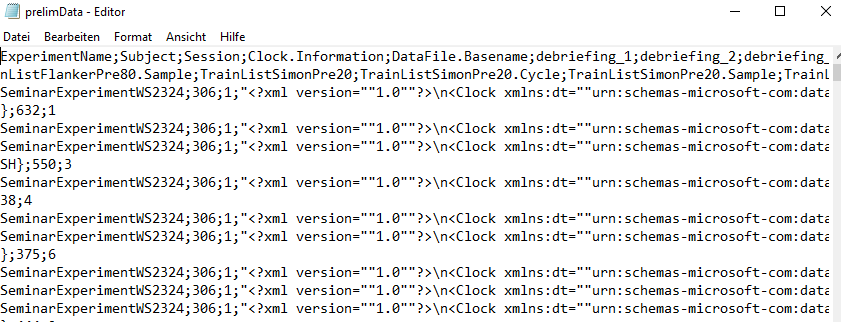

# Import Data

Beginners at programming or data analysis commonly struggle first with importing the experimental data. Given that you already stored your data locally, you first have to set the right directory (R needs to be set to the file path, or it won't see the file. In contrary to for example Python, the directory is not set automatically to the path of the R file you open. So it has to be set every time you re-open R and want to run the script.)


## Set directory to file path

You can see the current file path with the command `getwd()` - this should print a file path, for example `"U:/Documents"` (the function literally means get working directory). You can change this directory with the function `setwd()`. This function needs the concerning path argument, so for example you could run `setwd("U:/Documents/Project/Folder/")`. You can check all the files in the current directory by running `dir()` - this will print all files located in the current directory.


## Import files

Reading data into your R environment can be as confusing. R is compatible with any common table format (csv, .xlsx, .txt, .tsv, SPSS files, etc.), but requires different approaches for different formats and files.


```{r, echo = TRUE}
### Examples on how to import different file formats

## Text file
# dat <- read.table("textfile.txt")

## csv file
# dat <- read.csv("data.csv")
# dat <- read.csv2("data.csv")

## Rdata (R-dataframes)
# load(file = "file.Rdata")

## SPSS-data
# install.packages("foreign") # install required package first
# dat <- as.data.frame(foreign::read.spss("SPSSdata.sav"))

## Excel file
# install.packages("readxl")
# dat <- readxl::read_xlsx("data.xlsx")

## SAS file
# install.packages("haven")
# dat <- haven::read_sas("SASfile.sas7bdat")
```


### Import csv files

As data is most likely in a .txt or .csv format, they will be looked on in detail. You can use `read.table("filename")` to import both formats. For the data being imported correctly, one usually just has to set the two arguments and `sep = ...` and `header = ...`. To identify to correct arguments, I advice to first open the file in a text editor, such as vim, notepad (Mac), or Editor (Windows). It should look something like this:


```{r,  fig.cap = "Example csv-file", fig.align = "left", echo=FALSE}



```

By opening your data in an editor program you can see how the character by which values are separated (the delimiter). In this example, values are separated by a semicolon, so we would need to set `sep = ";"`. This value could otherwise be a comma (`sep = ","`), a white space (`sep = ""`) or a tabstop (`sep = "\t"`). Additionally, we have to set `header = TRUE`, because the first line of the document shows variable names (ExperimentName;Subject;...). This is most likely to be the case for experimental data. So to finally import data, you command should look something like this:

`dat <- read.table("myfile.csv", header = TRUE, sep = ";")`

If you are lazy, you also use the functions `read.csv()` or `read.csv2()`, both have specific default arguments for header and separator.


To ensure that importing worked correctly, you could either run `View()` or simply click on the dataframe listed in the Environment (top right panel in R Studio). Anything weird (like only one large row) is most likely due to wrongly specified arguments to `header = ...` and `sep = ...`. There could also be (rare) file issues, such as additional text or blank lines, additional delimiters, etc. 


Again, if you work with standard *.csv-output, either `read.csv("yourfile.csv")` or `read.csv2("yourfile.csv")` should work perfectly fine.

